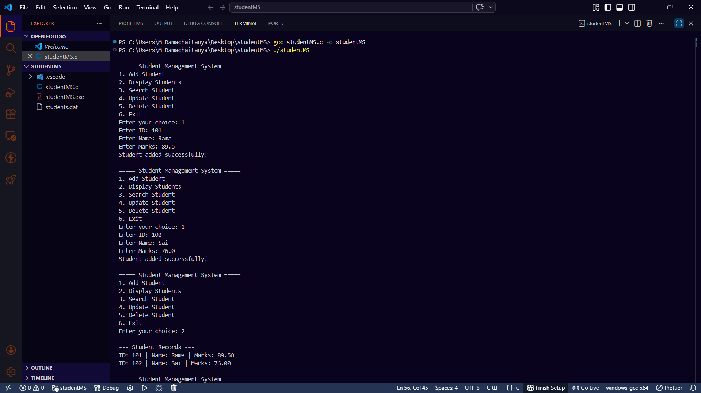
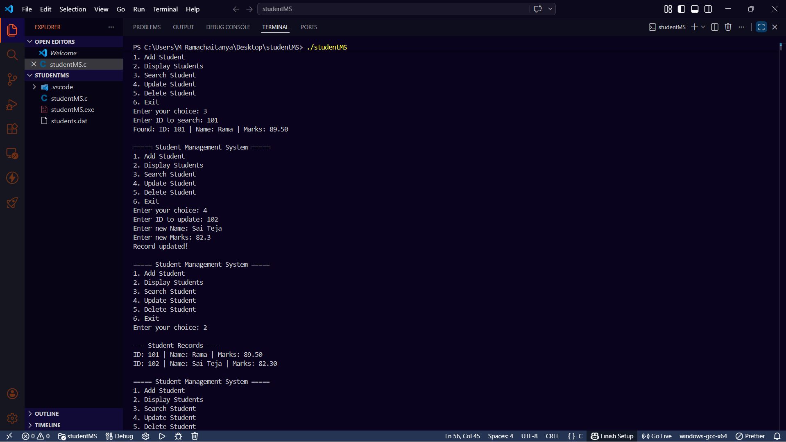
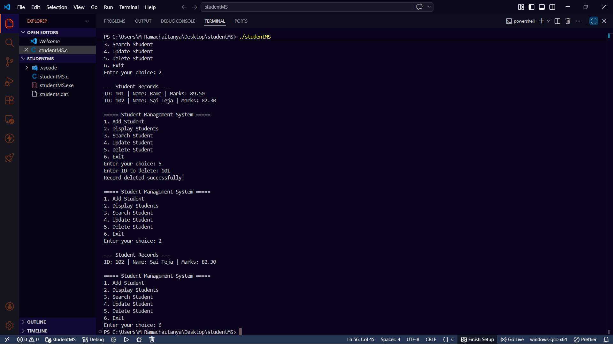

# Student Management System (C)

## Description

A simple **menu-driven C program** to manage student records using **structures and file handling**.
Data is stored permanently in a file.

---

## Features

* Add Student
* Display Students
* Search by ID
* Update Record
* Delete Record

---

## Technologies

* C Language
* File Handling
* Structures

---

---
## File Structure
```
studentMS/
│
├── studentMS.c
├── studentMS.exe
├── students.dat
├── StudentMS1.png
├── StudentMS2.png
├── StudentMS3.png
│
└── README.md
```
---

---

## How to Run

```
gcc studentMS.c -o studentMS
./studentMS
```

---

## Data File

* `students.dat` (auto-created)

---

## Sample Input/Output

```
===== Student Management System =====
1. Add Student
2. Display Students
3. Search Student
4. Update Student
5. Delete Student
6. Exit
Enter your choice: 1
Enter ID: 101
Enter Name: Rama
Enter Marks: 89.5
Student added successfully!

===== Student Management System =====
1. Add Student
2. Display Students
3. Search Student
4. Update Student
5. Delete Student
6. Exit
Enter your choice: 1
Enter ID: 102
Enter Name: Sai
Enter Marks: 76.0
Student added successfully!

===== Student Management System =====
1. Add Student
2. Display Students
3. Search Student
4. Update Student
5. Delete Student
6. Exit
Enter your choice: 2
--- Student Records ---
ID: 101 | Name: Rama | Marks: 89.50
ID: 102 | Name: Sai | Marks: 76.00

===== Student Management System =====
1. Add Student
2. Display Students
3. Search Student
4. Update Student
5. Delete Student
6. Exit
Enter your choice: 3
Enter ID to search: 101
Found: ID: 101 | Name: Rama | Marks: 89.50

===== Student Management System =====
1. Add Student
2. Display Students
3. Search Student
4. Update Student
5. Delete Student
6. Exit
Enter your choice: 4
Enter ID to update: 102
Enter new Name: Sai Teja
Enter new Marks: 82.3
Record updated!

===== Student Management System =====
1. Add Student
2. Display Students
3. Search Student
4. Update Student
5. Delete Student
6. Exit
Enter your choice: 2
--- Student Records ---
ID: 101 | Name: Rama | Marks: 89.50
ID: 102 | Name: Sai Teja | Marks: 82.30

===== Student Management System =====
1. Add Student
2. Display Students
3. Search Student
4. Update Student
5. Delete Student
6. Exit
Enter your choice: 5
Enter ID to delete: 101
Record deleted successfully!

===== Student Management System =====
1. Add Student
2. Display Students
3. Search Student
4. Update Student
5. Delete Student
6. Exit
Enter your choice: 2
--- Student Records ---
ID: 102 | Name: Sai Teja | Marks: 82.30

===== Student Management System =====
1. Add Student
2. Display Students
3. Search Student
4. Update Student
5. Delete Student
6. Exit
Enter your choice: 6
```

---
## Output ScreenShots

### ScreenShot 1


### ScreenShot 2


### ScreenShot 3


---

---

## Author
M.Bharadwaj
